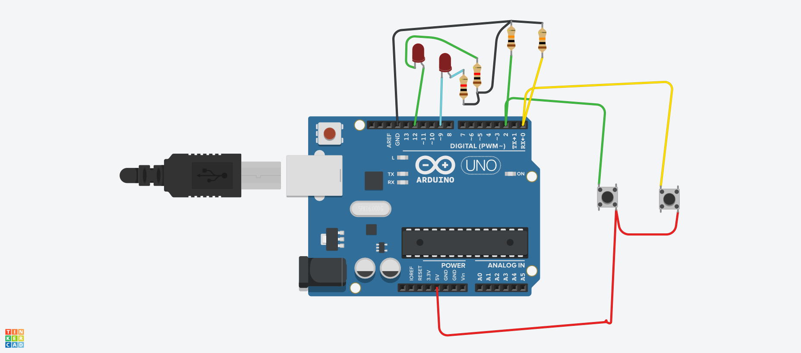
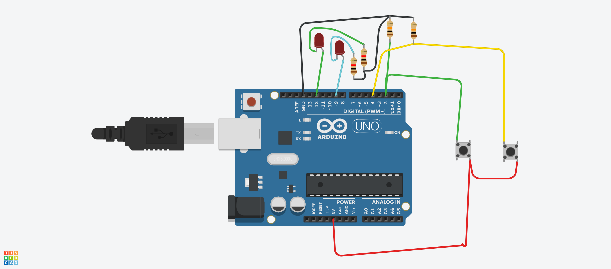

## New York University Abu Dhabi  
## Interactive Media Program
## Course title: Performing Robots
Course number: IM-UH 2117  
Credit Hours: 4     
Prerequisites: None     
Course website:
[https://github.com/michaelshiloh/PerformingRobots](https://github.com/michaelshiloh/PerformingRobots)  
Instructor: Michael Shiloh mshiloh@nyu.edu
Meeting times:    
1:15 PM - 3:55 PM M  
1:15 PM - 2:30 PM W  
Session: Fall 2020    
[Link](https://nyu.zoom.us/j/99801224178) to class Zoom meetings

This is subject to change

This document: Lecture Notes

[Today's lecture](#todays-lecture)

### Week 1

### September 7

Administration

- Record 

Introduction

- What is a robot?
- What is performance?
- Watch some videos
	- [Welcome to Duloc](https://www.youtube.com/watch?v=X81AoBcVnaA)
	- [Survival Research Labs](https://youtu.be/aZwkvM4BzN4?t=302)
	- [Bot and Dolly](https://youtu.be/lX6JcybgDFo?t=132)
	- [Oriza Hirata](https://youtu.be/CWnnqObk1qM)
	- [Robotic Church](https://vimeo.com/114296519#t=120s)

- Who am I?
- [weekly schedule](weeklySchedule.md)
- [Syllabus](syllabus.md)
- Summary:
  -  Be present and participate in class
  -  No electronic distractions
  -  Be proactive: Communicate with me regarding difficulties, problems, illness, etc.
  -  Allow lots of time for homework as physical construction
  and debugging circuits and programs can be very time consuming.
- Who are you?

Getting Ready

- Collecting stuff
- Cardboard
- Space
- Hot glue gun
- Rubbing Alcohol

Do along with me

- Discord
- Github
- Tinkercad

**Github**
- What is Github?
- Difference between an account and a repository
- Follow along with me and create an account
- Instructions for this are
[here](https://github.com/michaelshiloh/resourcesForClasses#github-resources).

Please use your name for your account name so that I 
can more easily recognize it. 
If you don't want to use your name for privacy reasons, 
please choose an alias that I can recognize as you.

Name your repository "Performing Robots"

- Edit your README.md file
	- What is README.md?
	- What is .md?
- Simple Markdown 
	- **Bold**
	- Paragraphs must be separated by a blank line
	- Inserting images: 
	- Always remember to commit your changes!
	- More [here](https://github.com/michaelshiloh/resourcesForClasses#github-resources).

**Tinkercad**

- Go to [Tinkercad](https://www.tinkercad.com) website
- Make an account with your NYU email address
- Create a project
- Select "circuit"

- Simple circuit
- Arduino
- LED + resistor
- Switch + resistor
- Conditionals
- Loops

### September 9

Administration

- Record lesson
- Discuss homework

Do along with me

- [Tinkercad](https://www.tinkercad.com) 
- Circuit
- Code
- ````if()```` statement (conditionals)
- ````for()```` loop
- Comparisons
	- Arduino reference page
	- Complex comparisons
- Communication
	- ````Serial()````
- Variables
- Functions
	- let's move the blinking into a separate function
	- Why use functions?
-	Making your program easier to read
	- For yourself and for others (e.g. your professor)
	- Good names for variables and functions
	- Functions
	- Indentation
	- Comments

Here is the example I did in class. I had made an error in both the code and
the circuit. See if you can spot the differences. First is what you saw
in class, with errors:


[Code](inClassExamples/september9/sept9CodeWithError.ino) with error

Now with corrections. Note where I used ````Serial.println()```` 
to help me find the problem:


[Code](inClassExamples/september9/sept9CodeCorrected.ino) after corrections


### September 14

Administration

- Welcome to week 2!
- Record lesson
- Questions about the homework

Test Arduino 
- Install [CH340
	driver](https://learn.sparkfun.com/tutorials/how-to-install-ch340-drivers)
- IDE
- blink

What else can we do?
- Serial
- IO foursome

Review
- Varibles
	- int, float
	- Difference between 
		- Declaration, which creates, or allocates, the variable
		- Assignment, which gives it a value
- Varible scope
	- Local
		- Allocation and freeing
	- Global
		- Allocated and never freed
- Functions

Reminder:
- Good variable and function names
- Indentation (demonstrate CTRL-T)

In-class exercise:
- Write a function that blinks an LED 5 times
	- Call it from setup
	- Call it from loop
	- How would you make it happen only once from loop?
		- State variable

Functions with arguments
- One argument
- Multiple arguments
- Return value!

Here are the examples we developed in class. First 
a function that takes two arguments and returns nothing:

````
void setup() {
  Serial.begin(9600);
}

void loop() {
  sayHello(9.7, 107); // intentionally passed the wrong parameter to show what happens
}

// A function that takes two arguments and returns nothing
void sayHello(int someInt, float someFloat) {
  Serial.print(someInt);
  Serial.print("  ");
  Serial.print(someFloat);
  Serial.println(" hello");
}
````

And now a function that takes one argument and returns something:

````
void setup() {
  pinMode(LED_BUILTIN, OUTPUT);
  Serial.begin(9600);
}

boolean firstTime = true; // state variable remembers whether it's the first time or not

void loop() {
  if (firstTime == true) {
    float theAnswer = blinkTimes(5);
    firstTime = false;
    Serial.println(theAnswer);
  }
}

// A function that takes one argument and returns a float
float blinkTimes(int count) {
  for (int i = count; i > 0; i -= 1) {
    digitalWrite(LED_BUILTIN, HIGH);
    delay(500);
    digitalWrite(LED_BUILTIN, LOW);
    delay(500);
  }
  return (count / 3.0);
}
````

### September 16

Administration
- Record lesson
- Have any kits arrived?

Working with Hot Glue 
- Cleaning
- Safety
	- Don't touch tip
	- If you get glue on you, wipe it off
	- Cold water (not the glue gun!)
- Construction techniques

More Arduino!

Libraries
- What is a library?

QWIIC
- What is it?
	- What is serial?
	- I2C
	- one-to-one vs. a bus
- Introducing the SparkFun [QWIIC
button](https://learn.sparkfun.com/tutorials/sparkfun-qwiic-button-hookup-guide/all)
button
- Install library: SparkFun Qwiic Button
- Run example: Example 1 - Prints the button status.

Time Permitting
- What's the problem with this example?
	- Hint: What if you were doing other things?
	- Blink Without Delay
	- Adafruit Multitasking Tutorial

### September 21

Administration

- Checkin
- Record lesson
- Have any kits arrived?
- Dates for presentations
	- Sept 30 Benjamin
	- October 7 Aleksandra
	- October 14 Muhammad
	- October 28 Sadeq 
	- November 4 Zheki
	- November 11 Baraa
	- November 18 Liyan
- Dates for student lead discussions
	- Sept 30 Liyan
	- October 7 Baraa
	- October 14 Aleksandra 
	- October 28 Zheki
	- November 4 Muhammad
	- November 11 Sadeq
	- November 18 Benjamin
- Guest speaker today

Homework review

- Quick review of homeworks

Do along with me

- OLED display
	- Install
		- Adafruit_SSD1306 
		- Adafruit_GFX
		- Adafruit BusIO
	- Run this example
		- SSD1306_128x64_i2c example 
	- Mor information in
		[this](https://learn.adafruit.com/monochrome-oled-breakouts?view=all#arduino-library-and-examples) tutorial

Guest speaker: Kid Koala 
Eric San, a.k.a Kid Koala, is a world-renowned scratch DJ,
music producer, and award winning graphic novelist. He has released 6 solo
albums, 4 on Ninja Tune:_ Carpal Tunnel Syndrome_ (2000), Some of My Best
Friends Are DJs (2003), Your Mom’s Favorite DJ (2006) and_ 12 bit Blues_
(2012) and 2 on Arts & Crafts. He has published 2 graphic novels: Nufonia Must
Fall (2003) and Space Cadet (2011). He has been involved in collaborations
such as Gorillaz, Deltron 3030, and The Slew. Kid Koala has toured with
Radiohead, the Beastie Boys, Money Mark, A Tribe Called Quest, DJ Shadow, and
The Preservation.

An internationally recognized DJ, Kid Koala has worked on projects that appeal
to a wide variety of audiences. 

About 3 1/2 years ago Kid Koala gave a performance at NYUAD using robots,
and this fall Kid Koala created a family-friendly show in Robot
House Party. The three-part event will lead kids to build their own robot
suits and dance in them.


### todays-lecture
### September 23

#### Administration

- Record 
- Where should I put the presentation and discussion assignments?
	- move to studentGithubRepositories
- SD card adapters

#### Discussion

- Eckersall

#### State

- [State Change Detection](https://www.arduino.cc/en/Tutorial/StateChangeDetection)
- [Blink without Delay](https://github.com/michaelshiloh/resourcesForClasses#blink-without-delay-resources)
- [Multitasking](https://learn.adafruit.com/multi-tasking-the-arduino-part-1?view=all)
